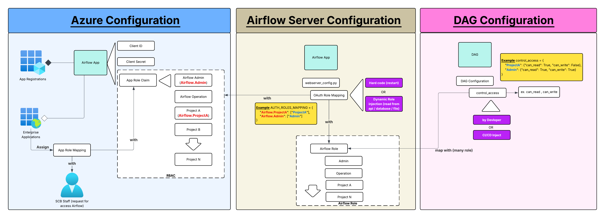
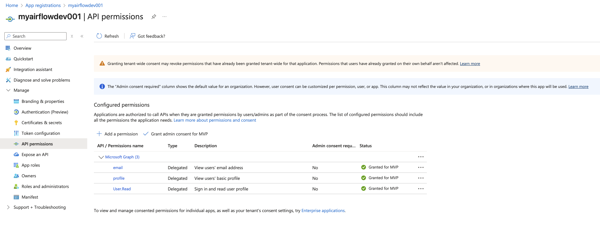
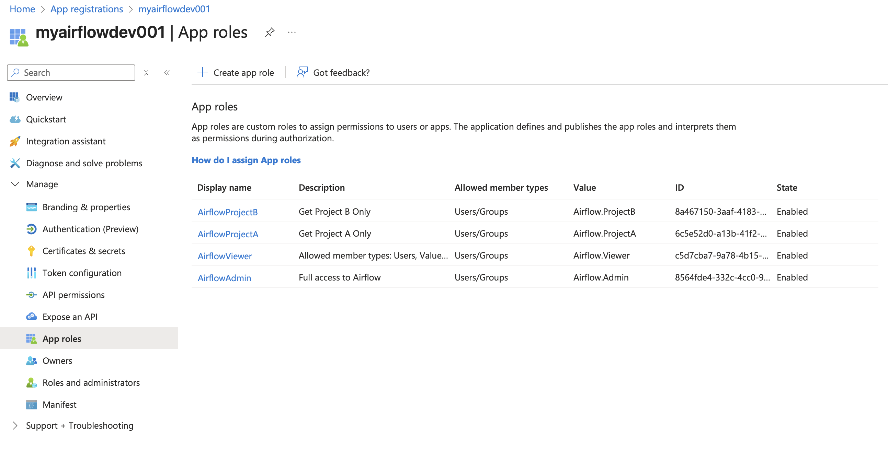
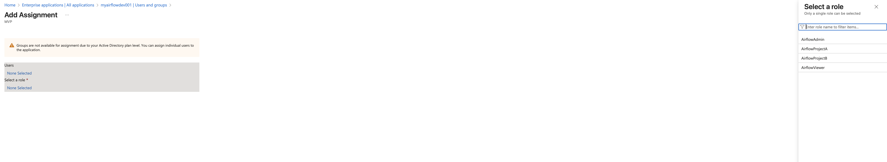
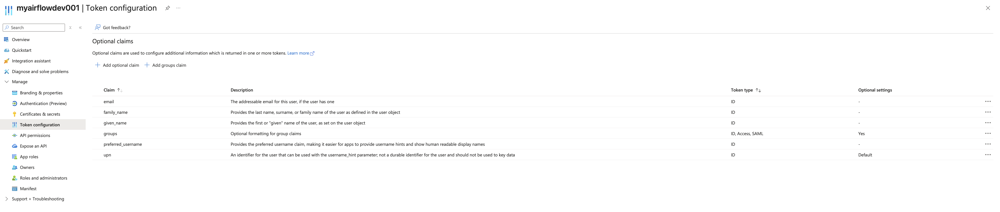
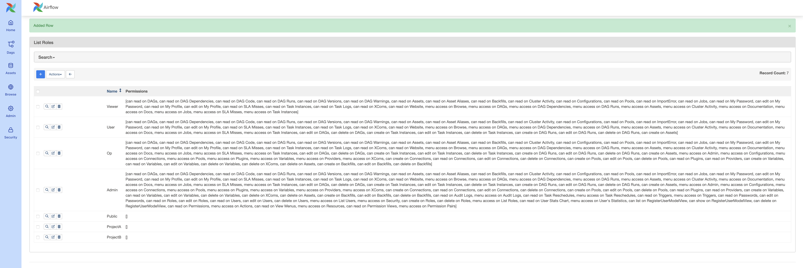

# Airflow Demo Project

This project demonstrates Apache Airflow configuration and setup using Docker Compose with custom configurations and persistent data storage.

> **🎯 Version Focus**: This project is specifically designed and tested for **Apache Airflow 3.0.2**. All configurations, dependencies, and documentation are optimized for this version.

## Overview

Apache Airflow is an open-source platform to develop, schedule, and monitor workflows. This demo project showcases various Airflow configurations, best practices, and includes a complete Docker-based setup with:

- **Custom webserver configuration** with RBAC and authentication
- **Persistent PostgreSQL database** with local volume mounting
- **Easy-to-use management script** for common operations
- **Production-ready setup** with proper volume mounts and configurations

## Quick Start

### Prerequisites

- Docker and Docker Compose installed
- At least 4GB of RAM available
- At least 2 CPU cores recommended
- At least 10GB of free disk space

### Getting Started

1. **Clone the repository**
   ```bash
   git clone <repository-url>
   cd airflowdemo
   ```

2. **Initialize Airflow (first time only)**
   ```bash
   ./run.sh init
   ```

3. **Start Airflow services**
   ```bash
   ./run.sh up
   ```

4. **Access Airflow Web UI**
   - URL: http://localhost:8080
   - Default credentials: `admin` / `admin`

5. **Stop services when done**
   ```bash
   ./run.sh down
   ```

## Management Script (`run.sh`)

The project includes a convenient shell script for managing your Airflow setup:

### Available Commands

| Command | Description |
|---------|-------------|
| `./run.sh` or `./run.sh up` | Start Airflow services |
| `./run.sh down` | Stop and remove services |
| `./run.sh restart` | Restart all services |
| `./run.sh logs` | Show logs from all services |
| `./run.sh status` | Show status of all services |
| `./run.sh init` | Initialize Airflow (run first time) |
| `./run.sh clean` | Clean up everything (containers, volumes, networks) |
| `./run.sh help` | Show help message |

### Script Features

- ✅ **Automatic setup** - Creates necessary directories
- ✅ **Environment handling** - Sets AIRFLOW_UID automatically
- ✅ **Docker validation** - Checks if Docker is running
- ✅ **Colored output** - Easy-to-read status messages
- ✅ **Safety prompts** - Confirmation for destructive operations

## Architecture

### Services

The Docker Compose setup includes the following services:

- **airflow-webserver** - Web UI and API server
- **airflow-scheduler** - Task scheduler
- **airflow-dag-processor** - DAG processing
- **airflow-worker** - Celery worker for task execution
- **airflow-triggerer** - Trigger management
- **postgres** - Database backend with persistent storage
- **redis** - Message broker for Celery

### Volume Mounts

| Local Path | Container Path | Purpose |
|------------|----------------|----------|
| `./dags` | `/opt/airflow/dags` | DAG files |
| `./logs` | `/opt/airflow/logs` | Airflow logs |
| `./config` | `/opt/airflow/config` | Configuration files |
| `./plugins` | `/opt/airflow/plugins` | Custom plugins |
| `./webserver_config.py` | `/opt/airflow/webserver_config.py` | Webserver configuration |
| `./pg_data` | `/var/lib/postgresql/data` | PostgreSQL data (persistent) |

## Project Structure

```
airflowdemo/
├── docker-compose.yaml          # Docker Compose configuration
├── run.sh                       # Management script
├── webserver_config.py          # Airflow webserver configuration
├── README.md                    # This file
├── .gitignore                   # Git ignore rules
├── dags/                        # DAG files directory
├── logs/                        # Airflow logs directory
├── config/                      # Configuration files
├── plugins/                     # Custom plugins
├── pg_data/                     # PostgreSQL data (auto-created)
└── images/                      # Documentation images
    ├── RBAC-Config.png
    ├── APIPermission.png
    ├── AppRole.png
    ├── EnterpriseAppAssignRole.png
    └── TokenConfiguration.png
```

## Configuration

### RBAC Configuration

The project includes Role-Based Access Control (RBAC) configuration for Airflow:



### API Permissions

API permission configuration:



### Application Roles

Application role setup:



### Enterprise App Role Assignment

Enterprise application role assignment:



### Token Configuration

Token configuration settings:



## Dependencies and Version Requirements

### FAB Authentication Provider

This project uses `apache-airflow-providers-fab==2.3.0` for authentication management. Here's why this specific version is required:

#### Why FAB Provider is Needed

- **Airflow 3.0.2 Compatibility**: Airflow 3.0.2 requires the Flask-AppBuilder (FAB) authentication manager for proper web UI authentication
- **Authentication Manager**: The FAB provider supplies the `FabAuthManager` class that handles user authentication, authorization, and RBAC
- **OAuth Integration**: Required for Azure AD OAuth integration and other external authentication providers
- **Security Features**: Provides advanced security features like role-based access control (RBAC) and user management

#### Version Specification

```yaml
_PIP_ADDITIONAL_REQUIREMENTS: apache-airflow-providers-fab==2.3.0
```

**Why version 2.3.0 specifically:**
- **Stability**: Version 2.3.0 is tested and stable with Airflow 3.0.2
- **Compatibility**: Ensures compatibility with the authentication manager configuration
- **Bug Fixes**: Contains important fixes for OAuth and RBAC functionality
- **API Compatibility**: Compatible with the API server authentication requirements

#### Official Documentation

For more information about the FAB provider and authentication in Airflow:

- **Airflow Authentication**: [https://airflow.apache.org/docs/apache-airflow/stable/security/index.html](https://airflow.apache.org/docs/apache-airflow/stable/security/index.html)
- **FAB Provider Documentation**: [https://airflow.apache.org/docs/apache-airflow-providers-fab/stable/index.html](https://airflow.apache.org/docs/apache-airflow-providers-fab/stable/index.html)
- **Docker Installation**: [https://airflow.apache.org/docs/docker-stack/index.html](https://airflow.apache.org/docs/docker-stack/index.html)
- **Authentication Managers**: [https://airflow.apache.org/docs/apache-airflow/stable/security/auth-manager.html](https://airflow.apache.org/docs/apache-airflow/stable/security/auth-manager.html)

#### Configuration in Docker Compose

The FAB provider is automatically installed when containers start:

```yaml
environment:
  AIRFLOW__CORE__AUTH_MANAGER: airflow.providers.fab.auth_manager.fab_auth_manager.FabAuthManager
  _PIP_ADDITIONAL_REQUIREMENTS: apache-airflow-providers-fab==2.3.0
```

**Important Notes:**
- The provider is installed at container startup (development only)
- For production, build a custom Docker image with the provider pre-installed
- The auth manager configuration is set via environment variables
- Azure OAuth variables are configured for external authentication

## Azure AD Authentication Configuration

### Overview

This project is configured with Azure Active Directory (Azure AD) OAuth authentication using Flask-AppBuilder (FAB) authentication manager. Users can log in using their Azure AD credentials and are automatically assigned Airflow roles based on their Azure AD app roles.

### Environment Variables Required

The following environment variables must be set in your `.env` file or Docker Compose environment:

```bash
AZURE_TENANT_ID=your-tenant-id
AZURE_CLIENT_ID=your-client-id  
AZURE_CLIENT_SECRET=your-client-secret
```

### Azure AD App Registration Setup

1. **Create App Registration** in Azure AD
2. **Configure Authentication**:
   - Add redirect URI: `http://localhost:8080/oauth-authorized/azure`
   - Enable ID tokens and access tokens
3. **Set API Permissions**:
   - Microsoft Graph: `openid`, `email`, `profile`, `User.Read`
4. **Create App Roles** (optional but recommended):
   - `Airflow.Admin` - Full administrative access
   - `Airflow.Viewer` - Read-only access
   - `Airflow.ProjectA` - Project A specific access
   - `Airflow.ProjectB` - Project B specific access

### Role Mapping Configuration

The `webserver_config.py` file contains a custom `CustomSecurityManager` class that maps Azure AD app roles to Airflow roles:

```python
role_mapping = {
    "Airflow.Admin": "Admin",
    "Airflow.Viewer": "Viewer", 
    "Airflow.ProjectA": "ProjectA",
    "Airflow.ProjectB": "ProjectB",
}
```

**Role Extraction Logic:**
- Checks both `id_token_claims` and `userinfo` for roles
- Maps Azure AD app roles to corresponding Airflow roles
- Falls back to default "Viewer" role if no roles are mapped
- Provides detailed logging for troubleshooting

**Airflow Roles:**



### Authentication Flow

1. **User clicks "Sign in with Azure"** on Airflow login page
2. **Redirected to Azure AD** for authentication
3. **Azure AD returns tokens** with user info and roles
4. **Custom SecurityManager** extracts and maps roles
5. **User logged into Airflow** with appropriate permissions

### Troubleshooting Authentication

#### Common Issues

**Issue: Users get "Viewer" role instead of expected role**

*Solution:* Check the authentication logs:
```bash
docker-compose logs airflow-apiserver | grep "🔐"
```

Look for:
- `🔐 Roles from userinfo: ['Airflow.Admin']` - Shows roles from Azure AD
- `🔐 Mapped 'Airflow.Admin' -> 'Admin'` - Shows successful mapping
- `🔐 Final mapped Airflow roles: ['Admin']` - Shows final result

**Issue: "Missing required Azure env vars" error**

*Solution:* Ensure all Azure environment variables are set:
```bash
# Check if variables are set
echo $AZURE_TENANT_ID
echo $AZURE_CLIENT_ID
echo $AZURE_CLIENT_SECRET
```

**Issue: OAuth redirect URI mismatch**

*Solution:* Verify redirect URI in Azure AD app registration matches:
```
http://localhost:8080/oauth-authorized/azure
```

#### Debug Authentication

**Enable detailed logging:**
```bash
# View authentication logs in real-time
docker-compose logs -f airflow-apiserver | grep -E "🔐|✅|⚠️"
```

**Check user roles in Airflow:**
1. Log into Airflow as admin
2. Go to Security → List Users
3. Check user's assigned roles

**Test role mapping:**
```bash
# Check if roles are being extracted correctly
docker-compose logs airflow-apiserver --tail=100 | grep "Final user_info"
```

### Security Considerations

- **CSRF Protection**: Enabled with `WTF_CSRF_ENABLED = True`
- **Role Synchronization**: `AUTH_ROLES_SYNC_AT_LOGIN = True` updates roles on each login
- **Default Role**: New users get "Viewer" role by default
- **Environment Variables**: Store sensitive Azure credentials securely

## Development

### Adding DAGs

1. Place your DAG files in the `dags/` directory
2. DAGs will be automatically detected and loaded by Airflow
3. Use the web UI to monitor and trigger your DAGs

### Custom Plugins

1. Add custom operators, hooks, or sensors to the `plugins/` directory
2. Follow Airflow plugin development guidelines
3. Restart services to load new plugins: `./run.sh restart`

### Configuration Changes

- **Airflow configuration**: Edit files in the `config/` directory
- **Webserver settings**: Modify `webserver_config.py`
- **Docker settings**: Update `docker-compose.yaml`
- **Environment variables**: Edit `.env` file

## Troubleshooting

### Common Issues

#### 1. Permission Issues
```bash
# Fix file permissions
sudo chown -R $USER:$USER .
./run.sh init
```

#### 2. Port Already in Use
```bash
# Check what's using port 8080
lsof -i :8080

# Kill the process or change port in docker-compose.yaml
```

#### 3. Database Connection Issues
```bash
# Clean and reinitialize
./run.sh clean
./run.sh init
./run.sh up
```

#### 4. Memory Issues
```bash
# Check Docker memory allocation
docker system df
docker system prune -f
```

#### 5. DAG Import Errors (Airflow 3.0.2 Breaking Changes)

**Problem**: DAGs fail to import with errors like:
```
TypeError: DAG.__init__() got an unexpected keyword argument 'schedule_interval'
```

**Root Cause**: Airflow 3.0.2 has breaking changes from earlier versions:
- `schedule_interval` parameter is no longer supported
- Must use `schedule` parameter instead

**Solution**: Update your DAG definitions:

❌ **Old syntax (Airflow 2.x):**
```python
with DAG(
    'my_dag',
    schedule_interval='@daily',  # Not supported in 3.0.2
    start_date=datetime(2025, 1, 1),
) as dag:
    pass
```

✅ **New syntax (Airflow 3.0.2):**
```python
with DAG(
    'my_dag',
    schedule='@daily',  # Use 'schedule' instead
    start_date=datetime(2025, 1, 1),
) as dag:
    pass
```

**Common schedule values:**
- `schedule='@daily'` - Run daily
- `schedule='@hourly'` - Run hourly
- `schedule='0 2 * * *'` - Run at 2 AM daily (cron format)
- `schedule=None` - Manual trigger only

**Check DAG import errors:**
```bash
# View DAG processor logs
docker-compose logs airflow-dag-processor --tail=100

# Check import errors via API
curl "http://localhost:8080/api/v2/importErrors"
```

**Example working DAG**: See `example_dag_airflow_3.py` in the project root for a complete example compatible with Airflow 3.0.2.

## Security Considerations

### Production Deployment

⚠️ **Important**: This setup is for development/demo purposes. For production:

1. **Change default credentials**
2. **Use secure passwords** for database and Redis
3. **Enable HTTPS** with proper SSL certificates
4. **Configure proper authentication** (LDAP, OAuth, etc.)
5. **Set up proper network security**
6. **Use secrets management** for sensitive data
7. **Enable audit logging**

### Environment Variables

Create a `.env` file for environment-specific settings:

```bash
# .env file example
AIRFLOW_UID=1000
AIRFLOW__CORE__FERNET_KEY=your-fernet-key-here
AIRFLOW__WEBSERVER__SECRET_KEY=your-secret-key-here
```

## Backup and Recovery

### Database Backup

```bash
# Backup PostgreSQL data
docker-compose exec postgres pg_dump -U airflow airflow > backup.sql

# Or backup the entire pg_data directory
tar -czf pg_data_backup.tar.gz pg_data/
```

### Restore Database

```bash
# Restore from SQL dump
docker-compose exec -T postgres psql -U airflow airflow < backup.sql

# Or restore pg_data directory
./run.sh down
rm -rf pg_data/
tar -xzf pg_data_backup.tar.gz
./run.sh up
```

## Performance Tuning

### Resource Allocation

Adjust resource limits in `docker-compose.yaml`:

```yaml
services:
  airflow-webserver:
    deploy:
      resources:
        limits:
          memory: 1G
          cpus: '0.5'
```

### Database Optimization

- Monitor database performance with `./run.sh logs postgres`
- Consider using connection pooling for high-load scenarios
- Regular database maintenance and cleanup

## Monitoring

### Health Checks

```bash
# Check service health
./run.sh status

# Check individual service health
docker-compose ps
curl http://localhost:8080/health
```

### Metrics and Logging

- Airflow logs are available in the `logs/` directory
- Use the web UI for task monitoring and debugging
- Consider integrating with external monitoring tools


## Contributing

1. Fork the repository
2. Create a feature branch
3. Make your changes
4. Test thoroughly
5. Submit a pull request

## License

This project is licensed under the MIT License - see the LICENSE file for details.

## Support

For issues and questions:

- Check the [troubleshooting section](#troubleshooting)
- Review Airflow documentation: https://airflow.apache.org/docs/
- Open an issue in the repository

## Changelog

### v1.0.0
- Initial setup with Docker Compose
- Custom webserver configuration
- Persistent PostgreSQL storage
- Management script for easy operations
- Comprehensive documentation


